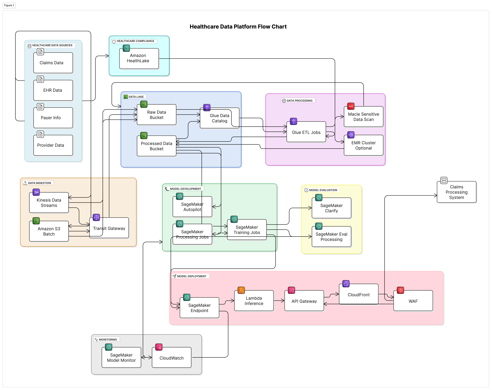

# predicting-insurance-claim-approvals
generating realistic synthentic data representing 3 years of medical insurance claims, in order to build a ML model that will predict if a claim will be denied or approved (yes/no) as well as the probability.

---

`claim_status` = 1, claim was DENIED. if `claim_status` = 0, claim was approved. 

claude was tasked with generating four different datasets with more detailed information for patients, providers and payers. 

gemini was tasked with a single output file that does not contain these level of details.

---

## MVP MLops Pipeline in AWS 

</p">
